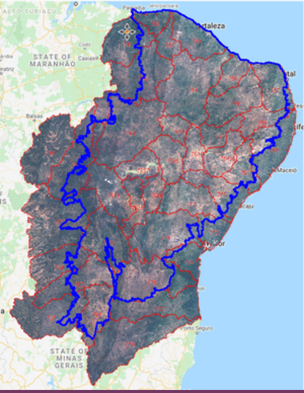
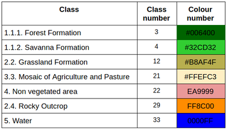
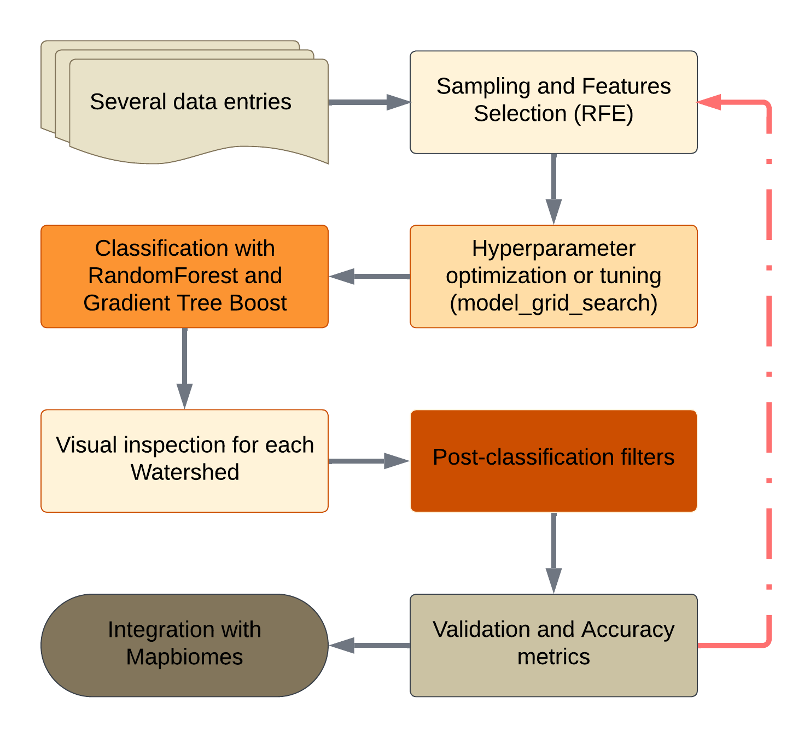
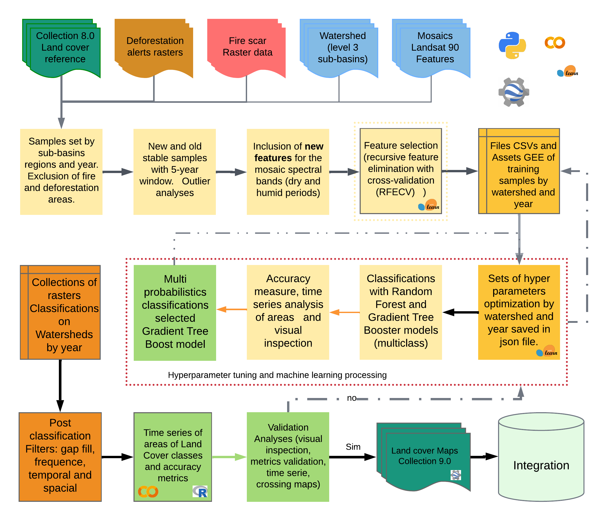
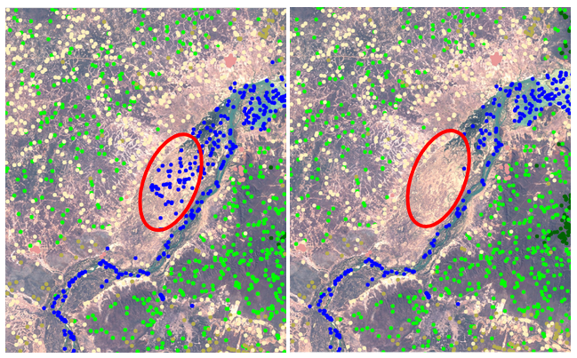
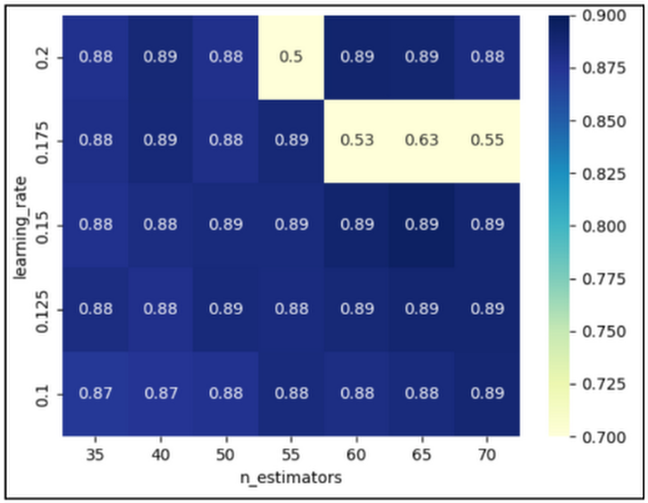
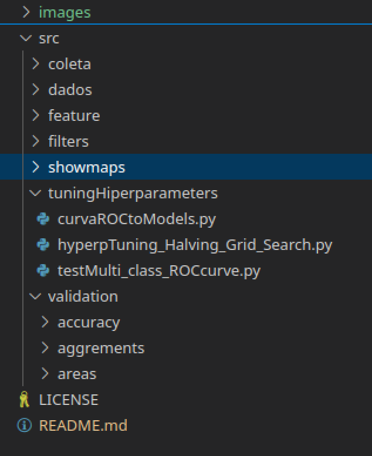

# Mapping methodology for Constructing 39-Year Land Use and Land Cover Maps in the Mapbiomas Project (Caatinga Team)

In this repository, we share a set of scripts that were used for the construction of land use and land cover maps for the Caatinga biome in collection 9.0 of the Mapbiomas project. The maps were created using the Mapbiomas mosaics available in the asset “projects/mapbiomas-workspace/MOSAICOS/workspace-c3“. Each Mapbiomas mosaic refers to a specific year within the 1985-2023 series and to a 1:250,000 scale geographic map cutout. To process these data, the mosaics are combined and clipped according to the level 2 watershed boundaries, as shown in Figure 1. Some watersheds were brought to level 3 to facilitate calculations in the Google Earth Engine API.


<p align="center">
    
</p>

Figure 1: Hydrographic basins, mosaics, and collection 5.0 land use land cover map.

Codes of the legend classes and color palette used in MapBiomas Collections, available at:
https://mapbiomas.org/codigos-de-legenda?cama_set_language=pt-BR 


<p align="center">
    
</p>

Table 1: Legend of the classified classes.

The process flow of the mapping is grouped into 8 steps with some iterations between steps 2 and 7, figure 2 continued:

<p align="center">
    
</p>

Figure 2: Classification process of Mapbiomas current collection (1985-2023) in the Caatinga Biome.

A more detailed description of each of the steps covered in the flowchart above follows below, figure 3.

<p align="center">
    
</p>
Figure 3: Reduced Classification process of  mapping in Mapbiomas collection (1985-2023) in the time from Caatinga Biome.


### SUMMARY
* -- Collection of training samples and Data augmentation 
* -- Feature selection process 
* -- Hyperparameter tuning 
* -- Classification of Landsat image mosaics with Random Forest and Gradient Tree Boost. 
* -- Validation of classification based on accuracy and area 
* -- Post-classification process with filters 
* -- Validation of results


## Mapping  large volumes of data of satelital image
A pixel in the mosaic can only be used as sample pixels if it does not belong to any region of change in the land use and coverage maps, and is stable in a time window of 3 years. The changes considered are areas of burning, deforested areas, areas within a buffer of gaps caused by clouds or cloud shadows, areas of variability between consecutive years and ultimately the pixel must coincide with the class assigned in collection 7.1 in the land use and coverage map.

_The samples or resamples of training ROIs_ is divided into three important parts: 
* Selection of new point ROIs, using the criteria of unchanged collection areas.
* Selection of the new point spectral information (ROIs) samples from the 8.0 collection, which pass the no-change area criterion.
* Assemble training samples by year and by basin.

Two scripts are used for these collections:  
* “pontos_ROIs_with_Spectral_information.py”
* “recolect_ROIs_Normalize_Grade_with_Spectral_info_fromC8rois.py”

In both scripts you need to modify some parameters located in the param dictionary, for example.


```python
param = {
   'bioma': ["CAATINGA", 'CERRADO', 'MATAATLANTICA'],
   'asset_bacias': 'projects/mapbiomas-arida/ALERTAS/auxiliar/bacias_hidrografica_caatinga',
   'asset_IBGE': 'users/SEEGMapBiomas/bioma_1milhao_uf2015_250mil_IBGE_geo_v4_revisao_pampa_lagoas',
   'outAssetROIs': 'projects/mapbiomas-workspace/AMOSTRAS/col9/CAATINGA/ROIs/',
   # 'outAsset': 'projects/mapbiomas-workspace/AMOSTRAS/col5/CAATINGA/PtosXBaciasBalanceados/',
   'asset_ROIs_manual': {"id" : 'projects/mapbiomas-workspace/AMOSTRAS/col8/CAATINGA/ROIs/coletaROIsv7N2manual'},
   'asset_ROIs_cluster': {"id" : 'projects/mapbiomas-workspace/AMOSTRAS/col8/CAATINGA/ROIs/coletaROIsv6N2cluster'},
   'asset_ROIs_automatic': {"id" : 'projects/mapbiomas-workspace/AMOSTRAS/col9/CAATINGA/ROIs/cROIsGradeallBNDNormal'},
   'asset_shpGrade': 'projects/mapbiomas-arida/ALERTAS/auxiliar/basegrade30KMCaatinga',
   'showAssetFeat': False,
   'janela': 5,
   'escala': 30,
   'sampleSize': 0,
   'metodotortora': True,
   'tamROIsxClass': 4000,
   'minROIs': 1500,
   # "anoColeta": 2015,
   'anoInicial': 1985,
   'anoFinal': 2023,
   'sufix': "_1",

}
```

To collect enough and necessary items for each hydrographic basin, just leave the Tortora method, 1978 in effect, in the input parameters:
> 'metodotortora': True,

```javascript
/////////////////////////////////////////////////////////////////////////////////////
/// calculates the number of samples that represent each class well              ////
/// according to the percentage of presence of this class in the basin and the   ////
/// statistical representativeness                                               ////
/// n = z2 * (p * (1-p)) / E2 ===> z = 1.96 ====> E = 0.025 ==> no = 1 / E2      ////
/// n = (B * N * (1-N)) / E2                     Tortora index (1978)            ////
```
The sampling scripts already perform the Data Augmentation process for 25 new spectral indices from the mosaics of the dry period, rainy period and annual mosaic. These indices are:
* "ratio","rvi","ndwi","awei","iia","lai","gcvi","gemi","cvi",
* "gli","shape","afvi","avi","bsi","brba","dswi5", "lswi","mbi",
* "ui","osavi","ri","brightness","wetness","msi","gvmi","spri",
* "nir_contrast","red_contrast"

Each sample pixel has 124 different bands and spectral indices. This data is utilized to conduct all sample refinement and feature selection analysis.
Outlier removal is an effective approach for cleaning data during the preprocessing step. Outlier pixels in each coverage class are removed using a "Learning Vector Quantization, LVQ" clustering technique built in Google Earth Engine based on the paper KOHONEN, 1998. An example of this importance is shown in figure 4.

> ==> run: python filtroOutlierAmostrasv2.py

<p align="center">
    
</p>
Figure 4: Visualization of the result of removing outliers before and after.

### Feature Selecion process
The selection of bands or spectral indices to be used in an image classification process is critical to the model's performance and cost-effectiveness. For this research, all sample sets were downloaded in CSV format from the GEE asset. These provide information on each band in the mosaic. The methodology used for determining which bands in the mosaic are most significant is Recursive Feature Elimination with Cross Validation (RFECV), an additional feature selection method that employs cross-validation to automatically optimize the number of features selected. As a consequence, for each set of data (basin/year), a list of characteristics selected during the feature removal technique was stored (ZHANG AND JIANWEN, 2009; RAMEZAN, 2022).
https://scikit-learn.org/stable/auto_examples/feature_selection/plot_rfe_with_cross_validation.html
The script that have implemented the method are in the src/features/ 🗃️ folder with the name:

```python
 ==>  run: python methods_recursive_feature_elimination.py
```
### Hiperparamenter tuning

A script was implemented for the Hyperparameter Tuning process after selecting the variable sets by drainage basin and year. The GridSearchCV() function, along with the Pipeline() function, is capable of testing various parameter combinations for the model. It is then possible to establish which combination of parameters represents the best score or accuracy. The parameters of the estimator used to apply these methods are optimized by cross-validated grid-search over a parameter grid. An example of the "learning rate" parameters and "n estimators" is shown in figure 5, where the optimal pair of parameters would be (40, 0.175), for having the same accuracy with a smaller number of trees and a smaller learning rate.

<p align="center">
    
</p>

Figure 5. Example of the plot of combination of "learning rate" parameters and "n estimators".

The script for conducting this analysis is:
  > python hyperpTuning_Halving_Grid_Search.py


```python
model = Pipeline([           
            ("classifier", ensemble.GradientBoostingClassifier(
                                   n_estimators= 150,
                                   learning_rate= 0.01,
                                   subsample= 0.8,
                                   min_samples_leaf= 3,
                                   validation_fraction= 0.2,
                                   min_samples_split= 30,
                                   max_features= "sqrt"
                               ))
        ])
print("Modelo Pipeline ", model)

param_grid = {
    'classifier__learning_rate': (0.1, 0.125, 0.15, 0.175, 0.2),
    'classifier__n_estimators': (35,40, 50, 55, 60, 65, 70)
}
model_grid_search = GridSearchCV(
                            model,
                            param_grid= param_grid,
                            n_jobs= 2,
                            cv= 2
                        )
model_grid_search.fit(data_train, target_train)
accuracy = model_grid_search.score(data_test, target_test)
```

****
### Classification of Landsat image mosaics with Random Forest and Gradient Tree Boost.
Two Machine Learning models are used in the classification process. Random Forest and Gradient Tree Boost are ensemble classifiers that employ Decision Trees as their fundamental models (BREIMAN 2001; LAWRENCE et al. 2004). Each set of parameters is loaded from a json file created during the hyperparameter tuning phase. The default parameters are:


```python
'pmtRF': {
    'numberOfTrees': 165,
    'variablesPerSplit': 15,
    'minLeafPopulation': 40,
    'bagFraction': 0.8,
    'seed': 0
},
# https://scikit-learn.org/stable/modules/ensemble.html#gradient-boosting
'pmtGTB': {
    'numberOfTrees': 25,
    'shrinkage': 0.1,        
    'samplingRate': 0.8,
    'loss': "LeastSquares",#'Huber',#'LeastAbsoluteDeviation',
    'seed': 0
},

```
The script for conducting this analysis is:
> python classificacao_NotN_bacias_Float_col9_prob.py

The input parameters define the model to be used with the acronyms “RF” for Random Forest and “GTB” for Gradient Tree Boost.

### Post-classification process with filters
The filters used in this stage are intended to remove some of the imperfections in the raster maps. The first step, using the Gap Fill filter, eliminates the gaps coming from the mosaic gaps. The second step uses a spatial filter to remove tiny pixels from isolated classes. The third step uses a frequency filter to correct implausible changes in the historical series in natural classes, followed by a temporal filter to correct abrupt changes in a 3, 4, or 5-year window. The filters are available in the /src/filters 🗃️  sdfolder.

* “filtersGapFill_step1.py”
* “filtersSpatial_All_step2A.py”
* “filtersTemporal_step3.py”
* “filtersFrequency_step4mod.py”

### Validation

Validating a historical series of maps is a complex process that requires several approaches to reviewing the data. Each raster map is validated through two methods: the first calculates accuracy indices, and the second examines the time series of areas by class. The latter approach helps detect abrupt errors that may have gone undetected in the year-by-year examination. If the assessment results are unsatisfactory, the parameters and samples must be reviewed and reclassified again. The LAPIG/UFG team cited the reference points on the platform developed for this activity (tvi.lapig.iesa.ufg.br); for additional details, see the mapbiomas ATBD.
[https://mapbiomas-br-site.s3.amazonaws.com/ATBD_Collection_5_v1.pdf].

The scripts implemented for the validation process are in the /src/validation/ folder. Inside there are two more folders, one for calculating areas and another for calculating accuracies.

=>  run: python getCSVsPointstoAcc.py

All the points tables by year will be saved in the folder 🗃️ "ptosCol90" at your google drive. Once you have all the tables saved on your computer, change the path in the next script and run.

==>  run: python accuracy.py 


```python
param ={
    'assetOut': 'projects/mapbiomas-workspace/AMOSTRAS/col5/CAATINGA/classificacoes/classesV11/',
    'assetROIs': {'id':'projects/mapbiomas-workspace/AMOSTRAS/col4/CAATINGA/PtosBacias2_1000'},
    'anoInicial': 1985,
    'anoFinal': 2019,
    'pmtRF': {
       'numberOfTrees': 60,
       'variablesPerSplit': 6,
       'minLeafPopulation': 3,
       'maxNodes': 10,
       'seed': 0
    }
}
```
<!-- ''' -->
‘assetROIs’ is a folder within a GEE asset, which stores the sample ee.FeaturesCollection for each hydrographic basin. Each ee.FeaturesCollection has a set of points per year that will be used in the classification.

> == > run:  python classificacao_bacias_final.py

****
### Validation

Validation of a historical series of maps is a complex process that requires several ways to review the data. In order to generate a one-year map millions of pixels are classified, these classified pixels need a visual inspection and if the experts agree to move on to another step, which is the calculation of the accuracy indexes and analysis of the series of areas by class. The latter analysis helps to detect abrupt errors that could be overlooked in the analyzes per year. If the result of the evaluation is not satisfactory, it is necessary to return to the step of reviewing the parameters, samples and classifying again. The reference points were referenced by the LAPIG / UFG team on the platform developed for this activity (tvi.lapig.iesa.ufg.br), for more information visit the [ATBD of mapbiomas](https://mapbiomas-br-site.s3.amazonaws.com/ATBD_Collection_5_v1.pdf)


#### accuracy calculation
Modify the parameters, data asset and if the map is in Image or ImageCollection format from GEE
```python  
param= {  
    "assetCol5": 'projec…',
    "amostrarImg": True
}
```
> ==>  run: python getCSVsPointstoAcc.py

all points tables per year will be saved in the "ptosCol5" folder on your google drive. Once you have all the tables saved on your computer, you must change the path in the next script and run.

> ==>  run: python accuracy.py 

There is another script that calculates various other accuracy indicators such as recall, precision, F1 Score, as well as quantity and allocation errors.

> ==>  run: python newsMetrics_AccuracySamples.py 

In the “areas” folder you'll find some scripts for calculating areas and scripts for merging the results by version, region and year.

> ==> run: python calculoAreaV3.py
> ==> run: python join_tables_Basin_areas_by_Model_Vers.py

Ultimately, a script for visualization in graphs of the area and accuracy series.

> ==> open R-Studio  run col5.R

Other scripts for viewing raster maps, samples and other layers can be found in the showmaps 🗃️  folder.


****

Other scripts are distributed across folders within a main “src” script 🗃️ folder. This distribution follows the groups of functionalities or methods for the mapping process of the 9.0 collection, figure 6:

<p align="center">
    
</p>
Figura 6: Distribuição de scripts e pastas  por objetivos no projeto.


****
### Referencias:
Tortora, R. D. (1978). A note on sample size estimation for multinomial populations. The American Statistician, 32(3), 100-102.
Kohonen, T. (1998). Learning vector quantization, The handbook of brain theory and neural networks.
https://rstudio.com/wp-content/uploads/2015/03/rmarkdown-spanish.pdf

****